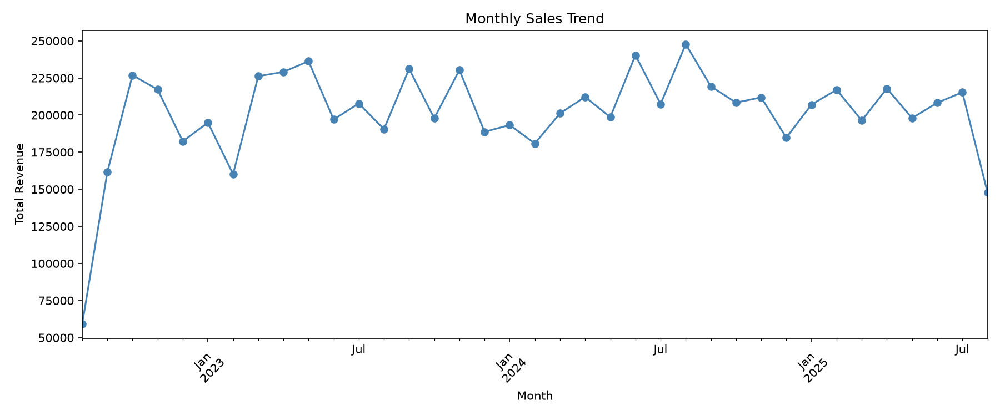
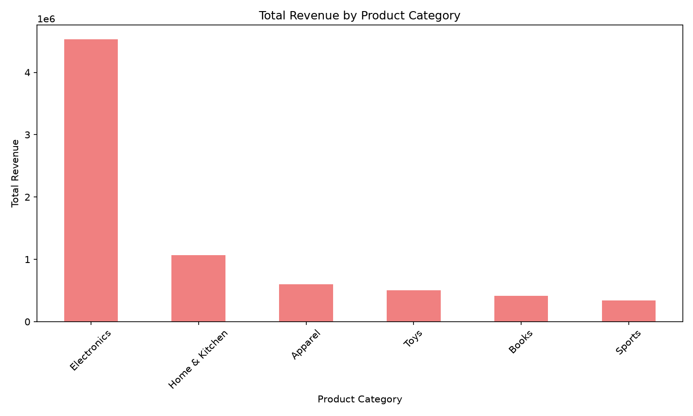
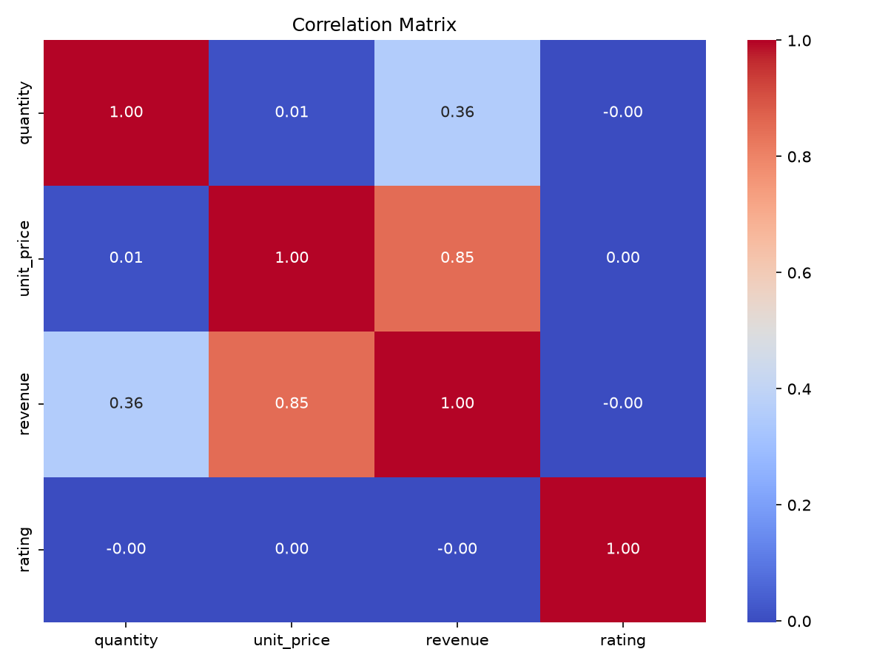

# EDA On Retail Sales Project
# Oasis Infobyte Internship Project

## Overview
This project delivers a complete, end-to-end Exploratory Data Analysis on a 10,000-record retail sales dataset, completed the project of the Data Analytics Internship at Oasis Infobyte. Beyond simply visualizing the data, this analysis uncovers concrete revenue drivers, customer behaviour patterns, and operational insights — translating raw numbers into actionable business recommendations. The workflow demonstrates practical proficiency in data cleaning, statistical analysis, and storytelling with data using Python's core analytics stack (pandas, matplotlib, seaborn), reflecting a business-first approach to data analysis rather than analysis for its own sake.


## Dataset

Source:
[E-commerce Dataset for SQL Analysis]: https://www.kaggle.com/datasets/nabihazahid/ecommerce-dataset-for-sql-analysis
Rows: 10,000
Columns: 20 
Column Names: customer_id, first_name, last_name, gender, age_group, signup_date, country, product_id, product_name, category, quantity, unit_price, order_id, order_date, order_status, payment_method, rating, review_text, review_id, review_date


## Analysis Performed
1. Initial inspection: shape, column data types, missing value check, duplicate check
2. Data cleaning and feature engineering: datetime conversion, revenue calculation, month/quarter extraction
3. Descriptive statistics: mean, median, mode, standard deviation
4. Time series analysis: monthly and quarterly sales trend line charts
5. Customer demographics analysis: age group distribution, gender breakdown
6. Product analysis: top 10 best-selling products, revenue by category
7. Correlation heatmap
8. Additional visualization: order status by payment method


## Key Insights
1. Dataset is fully clean: 0 missing values, 0 duplicate rows.
2. unit_price and revenue are right-skewed (mean greater than median).
3. Best month: August 2024 ($247,751). Best quarter: Q3 2024 ($674,535).
4. Orders are nearly evenly distributed across age groups and genders.
5. Dyson Vacuum is the top-selling product by units, but Electronics is the top revenue category ($4.53M, over 4x the next category).
6. Rating shows near-zero correlation with price, quantity, or revenue.
7. Order status is nearly identical across all payment methods.


## Business Recommendations
1. Prioritize Electronics category investment.
2. Investigate and replicate Q3 2024 performance drivers.
3. Consolidate marketing into a single cross-segment strategy.
4. Launch a post-delivery customer experience audit.
5. Do not restrict Cash on Delivery.


## Tools Used
Python
Pandas — data cleaning, wrangling, and analysis
Matplotlib & Seaborn — data visualization
Jupyter Notebook — development environment


## How to Run
1. Install the required libraries:
```bash
   pip install pandas matplotlib seaborn notebook
```
2. Place `ecommerce_dataset_10000.csv` in the same folder as the notebook.
3. Launch Jupyter Notebook:
```bash
   jupyter notebook
```
4. Open `EDA_Retail_Sales.ipynb` and select **Run All** from the Cell menu.


## Visualizations

### Monthly Sales Trend


### Revenue by Product Category


### Correlation Heatmap



## Author
Noor Ul Huda Fatima-Data Analytics Intern at Oasis Infobyte

GitHub: [https://github.com/noorulhuda-fatima]

LinkedIn: [www.linkedin.com/in/noor-ul-huda-fatima-a01382387]
